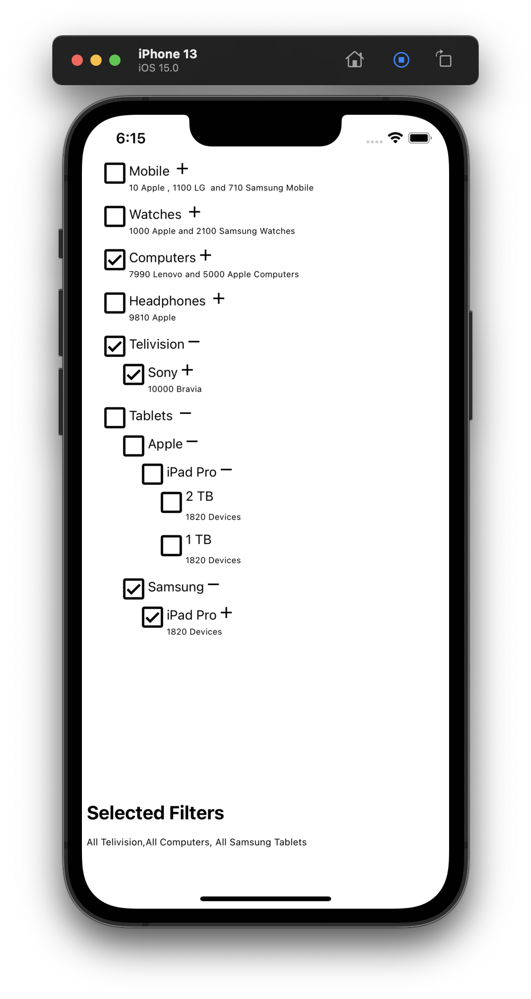
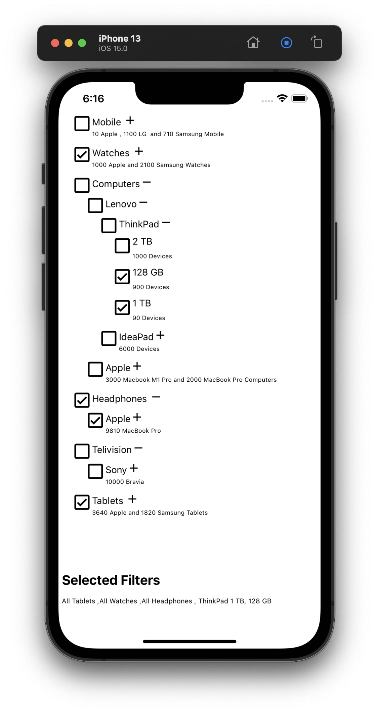

## MySoum
A sample react native filter component  for Soum.sa. Implemented using [react-native](https://reactnative.dev/) 0.68.x and typescript

## Getting started
```js
    npm install  
```
or
```js
    yarn 
```
from the root folder.

for iOS 
```js
    cd ios/ 
    pod install
```
To start iOS / Android application 

```js
    yarn ios 

    OR 

    yarn anmdroid 
```
 from the root folder.


 ### Requirement


Create a filter for the below hierarchy

1. Product Category (Mobile Phones, Watches, Computers etc)
2. Brand (Apple, Nokia etc.)
3. Model (iphone 8, iphone X etc.)
4. Variant ( 128 GB, 256GB etc.)
 
Using mock data (src/mock) to render the product listing and filter. 


 ### Usage


```js
      <ProductFilter data={filterMetadata} nodeView={NodeComponent} /> 
```

  ### Props

  #### data
  mandatory  field. an array of objects. Each object should have, basic info , id ,name and  'children'  

  ##### sample data

  src/mock
   and generating other meta data to print avilability info , name etc..
  
  #### nodeView

  corrosponding Component to render each node.


  ### TODO

Externalize more props like, icons, child object key and  node view componenyt with more flexibity for customization
 
1. Call back to get selected devcies 

### Screen shots / Demo

  
  


 
 